<div align="center">

<h3><code>shashidhar@github ~ $ ./contributions.sh</code></h3>



<br><br>

<h3><code>shashidhar@github ~ $ whoami</code></h3>

<table>
  <tr>
    <td valign="top"></td>
    <td valign="top"></td>
  </tr>
</table>

<br>

</div>

---

## Shashidhar Babu P V D (@shashidharbabu)

**Machine Learning Engineer | AI Engineer | Software Engineer | Data Scientist**  
I’ve worn different hats throughout my career — I build production-grade AI systems end-to-end: data → models → infra → developer experience.

- 🌎 San Jose, CA
- 🧠 Focus: LLM systems, RAG, multimodal AI, scalable backend/data platforms
- 🤝 Open to: OSS + applied AI engineering collaborations

### Links
- **GitHub**: https://github.com/shashidharbabu
- **LinkedIn**: https://www.linkedin.com/in/p-v-d-shashidhar-babu-9b91471b9/

---

## 🚀 Open source work (company / RocketRide)
### RocketRide Server — AI pipeline engine (C++ core + Python nodes)
**`rocketride-org/rocketride-server`**  
High-performance AI/data processing engine with 50+ pipeline nodes, multi-agent workflows, and SDKs (TypeScript, Python, MCP).  
- Repo: https://github.com/rocketride-org/rocketride-server
- Docs: https://docs.rocketride.org/

---

## 🧩 Featured projects
- **RocketRide Server** — production AI pipeline engine (C++/Python, SDKs, Docker)  
  https://github.com/rocketride-org/rocketride-server
- **Aerive Platform** — microservices travel booking platform (React/Vite/Tailwind, API gateway, Kafka, Redis, MongoDB, Postgres)  
  https://github.com/shashidharbabu/Aerive-Platform
- **Multimodal RAG** — multimodal retrieval system (text/image/audio/video)  
  https://github.com/shashidharbabu/multimodal-rag
- **Transformer from scratch** — end-to-end transformer implementation  
  https://github.com/shashidharbabu/transformer-architecture
- **AI NutriCoach** — food-image insights + personalized nutrition ideas  
  https://github.com/shashidharbabu/ai-nutricoach

---

## 🛠️ Skills (from my resume)

### LLMs / Agent Systems


### Machine Learning / NLP


### Data Engineering / MLOps


### Databases / Storage


### Languages


---

## 💬 A bit more about me
**“data, models, evals & robots(new interest!)”** — I care about the full system: correctness, performance, infra, and shipping.

---

<details>
<summary>🧪 How the art at the top is made</summary>

<br>

Everything above is self-contained animated SVG — no third-party stats service, no
GitHub token, no JavaScript. GitHub strips `<script>` from READMEs but does render
SVGs via `` and runs their CSS keyframe animations, so all the motion lives
inside the SVG files themselves.

| File | Made by | Refreshed |
| --- | --- | --- |
| `contrib-heatmap.svg` | `scripts/fetch_contributions.py` → `scripts/render_heatmap_svg.py` | daily, by GitHub Actions |
| `avi-ascii.svg` | `scripts/prep_photo.py` → `scripts/make_ascii_svg.py` | manually, when the photo changes |
| `info-card.svg` | `scripts/make_info_card.py` | manually, when the details change |

**Contribution data** is scraped from `github.com/users/<user>/contributions` — the
same public HTML fragment the profile page itself uses, so no auth is required.
`.github/workflows/update-profile-art.yml` re-scrapes and re-renders it on a daily
cron and commits the result.

**Regenerate locally:**

```bash
python -m venv .venv && source .venv/bin/activate
pip install -r scripts/requirements.txt          # heatmap
pip install -r scripts/requirements-portrait.txt # portrait

# heatmap (this is what the daily Action runs)
python scripts/fetch_contributions.py
python scripts/render_heatmap_svg.py

# portrait - the crop frames the subject out of a wider full-body shot, and
# --aspect is tuned so the portrait renders the same height as the info card
# (re-derive it whenever you add or remove rows from the card)
python scripts/prep_photo.py source-photo.jpg \
    --crop 0.214,0.055,0.786,0.663 --aspect 1.594
python scripts/make_ascii_svg.py

# info card
python scripts/make_info_card.py
```

Set `STATIC=1` on any of the render scripts to emit a frozen frame instead of an
animated one — useful for local previews.

</details>
